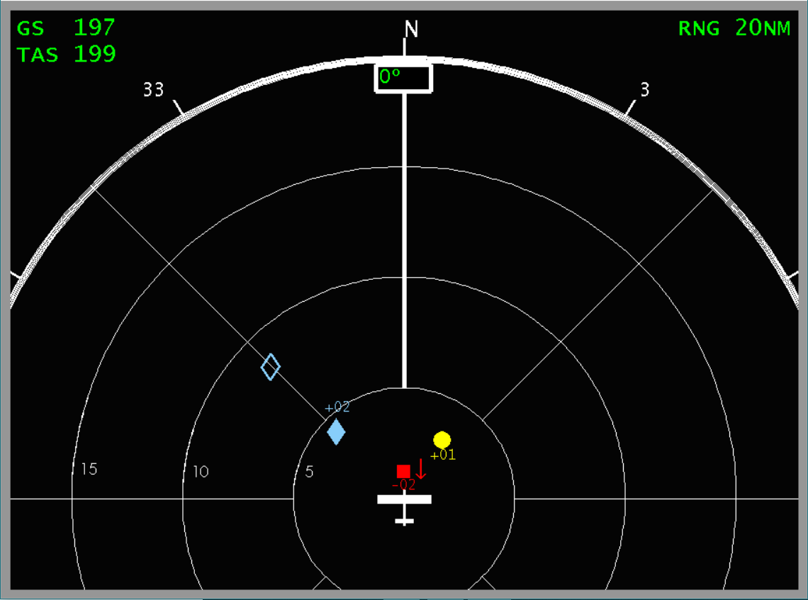

# SAInt-Proj

This repository contains the work developed for a Traffic Collision Avoidance
System (TCAS), in the curricular unit of Integrated Avionic Systems from
Instituto Superior Técnico. The objective of this work was to improve the
understandind of this type of systems.
In order to simulate our TCAS, a flight simulator (X-Plane) was used, to acquire
real-time data of the airplane in the simulation. This could then be treated and
analysed, and used to simulate the TCAS algorithm. A graphical interface
displaying the TCAS data, with sound alerts was also implemented.
In collaboration with several groups, a TCP communication protocol was
implemented, to exchange data amongst the several groups. Each group would
run and operate a simulator, and data would be exchanged amongst all groups.
This would then be used to simulate several TCAS systems, one for each simulator
running.



This repository is composed of:
* ProgramTCAS - a folder containing the complete code developed for the TCAS,
including communication with remaining groups.
* TestTCAS - a small program created to test the developed algorithm and
grapihcal interface. It simulates several aircrafts, and allows to perceive
how the program should run.
* AlertsTCAS - A folder containing the soundtracks for the TCAS alerts.
* ExampleClient - An example of a Python client that could be used to acquire
data from our program. This was made as an example for other groups, who should
receive data from our program, in order to simulate other avionic systems.

<!-- ## Getting Started

These instructions will get you a copy of the project up and running on your
local machine for development and testing purposes. See deployment for notes on
how to deploy the project on a live system. -->

<!-- ### Prerequisites


```
Give examples
``` -->

<!-- ### Installing

A step by step series of examples that tell you how to get a development env running

Say what the step will be

```
Give the example
```

And repeat

```
until finished
```

End with an example of getting some data out of the system or using it for a little demo -->


<!-- ## Deployment

Add additional notes about how to deploy this on a live system -->

<!-- ## Built With

* [Dropwizard](http://www.dropwizard.io/1.0.2/docs/) - The web framework used
* [Maven](https://maven.apache.org/) - Dependency Management
* [ROME](https://rometools.github.io/rome/) - Used to generate RSS Feeds -->

## Authors

* **Pedro Trindade**
* **António Negrinho**
* **Pedro Valdeira**
